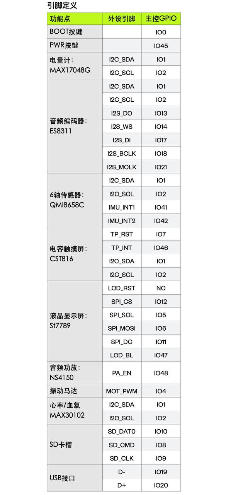

# ESP32-S3 Watch Hardware Specifications

**Board**: espwatch-s3b2

## Pinout Definition

## Key Components

| Component | Model | Interface | Pins |
|-----------|-------|-----------|------|
| **MCU** | ESP32-S3 | - | Dual-core Xtensa LX7, 240 MHz |
| **Display** | ST7789 | SPI | 240x285 LCD |
| **Touch Panel** | CST816 | I2C | Capacitive touch |
| **Audio Codec** | ES8311 | I2S + I2C | With PCA9557 |
| **IMU** | QMI8658C | I2C | 6-axis sensor |
| **Battery Gauge** | MAX17048G | I2C | Fuel gauge |
| **Heart Rate** | MAX30102 | I2C | SpO2/HR sensor |
| **Audio Amp** | NS4150 | GPIO | PA_EN |
| **Vibration Motor** | - | PWM | Haptic feedback |
| **SD Card** | - | SDIO | Storage |

## GPIO Assignment

### Power & Buttons
| Function | GPIO | Mode |
|----------|------|------|
| BOOT Button | IO0 | Input |
| PWR Button | IO35 | Input |

### I2C Bus (Shared)
| Function | GPIO | Note |
|----------|------|------|
| I2C_SDA | IO1 | Shared: Audio, IMU, Touch, Sensors |
| I2C_SCL | IO2 | Shared: Audio, IMU, Touch, Sensors |

### Display (ST7789)
| Signal | GPIO | Function |
|--------|------|----------|
| SPI_CS | IO12 | Chip Select |
| SPI_SCL | IO5 | Clock |
| SPI_MOSI | IO6 | Data Out |
| SPI_DC | IO11 | Data/Command |
| LCD_BL | IO47 | Backlight |

### Touch Panel (CST816)
| Signal | GPIO | Function |
|--------|------|----------|
| TP_RST | IO7 | Reset |
| TP_INT | IO46 | Interrupt |
| I2C_SDA | IO1 | Data (shared) |
| I2C_SCL | IO2 | Clock (shared) |

### Audio (ES8311)
| Signal | GPIO | Function |
|--------|------|----------|
| I2S_MCLK | IO21 | Master Clock |
| I2S_WS | IO14 | Word Select |
| I2S_BCLK | IO18 | Bit Clock |
| I2S_DI | IO17 | Data In |
| I2S_DO | IO13 | Data Out |
| PA_EN | IO48 | Power Amp Enable |

### IMU (QMI8658C)
| Signal | GPIO | Function |
|--------|------|----------|
| IMU_INT1 | IO41 | Interrupt 1 |
| IMU_INT2 | IO42 | Interrupt 2 |
| I2C_SDA | IO1 | Data (shared) |
| I2C_SCL | IO2 | Clock (shared) |

### Other Peripherals
| Function | GPIO | Note |
|----------|------|------|
| Vibration Motor | IO4 | PWM |
| SD_DAT0 | IO10 | SD Card Data |
| SD_CMD | IO8 | SD Card Command |
| SD_CLK | IO9 | SD Card Clock |
| USB_D- | IO19 | USB Native |
| USB_D+ | IO20 | USB Native |

## I2C Device Addresses

| Device | Address | Note |
|--------|---------|------|
| CST816 Touch | 0x15 | Default |
| ES8311 Audio | 0x18 | With PCA9557 |
| QMI8658C IMU | TBD | Check datasheet |
| MAX17048G | TBD | Check datasheet |
| MAX30102 | TBD | Check datasheet |

## Power Management

- **Battery**: LiPo (voltage TBD)
- **Charging**: USB-C
- **Fuel Gauge**: MAX17048G (I2C)
- **Power Buttons**: IO35 (PWR), IO0 (BOOT)

## Communication Interfaces

### SPI
- **Display**: SPI2_HOST (IO5, IO6, IO11, IO12)
- **SD Card**: SDIO mode (IO8, IO9, IO10)

### I2S
- **Audio Codec**: Full I2S with MCLK (IO13, IO14, IO17, IO18, IO21)

### USB
- **Native USB**: IO19 (D-), IO20 (D+)
- **Supports**: CDC, MSC, HID classes

---

**Document Version**: 0.1.0  
**Last Updated**: 2026-03-09  
**Source**: Hardware pinout definition image
